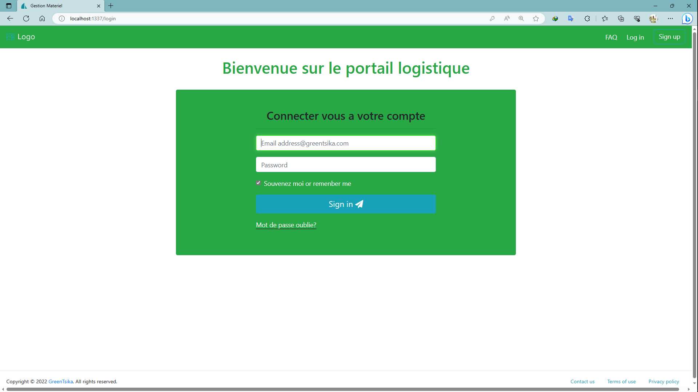
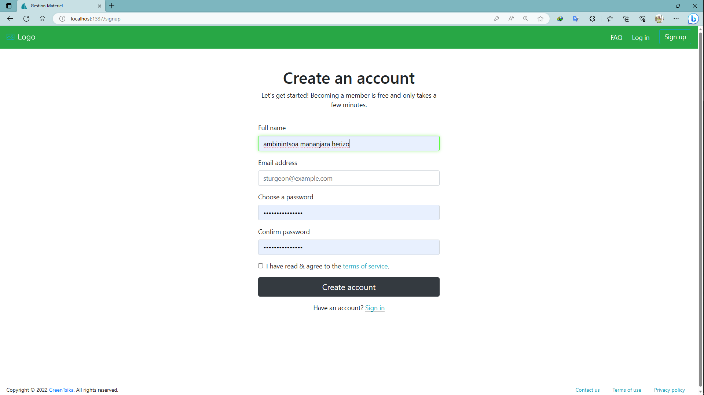
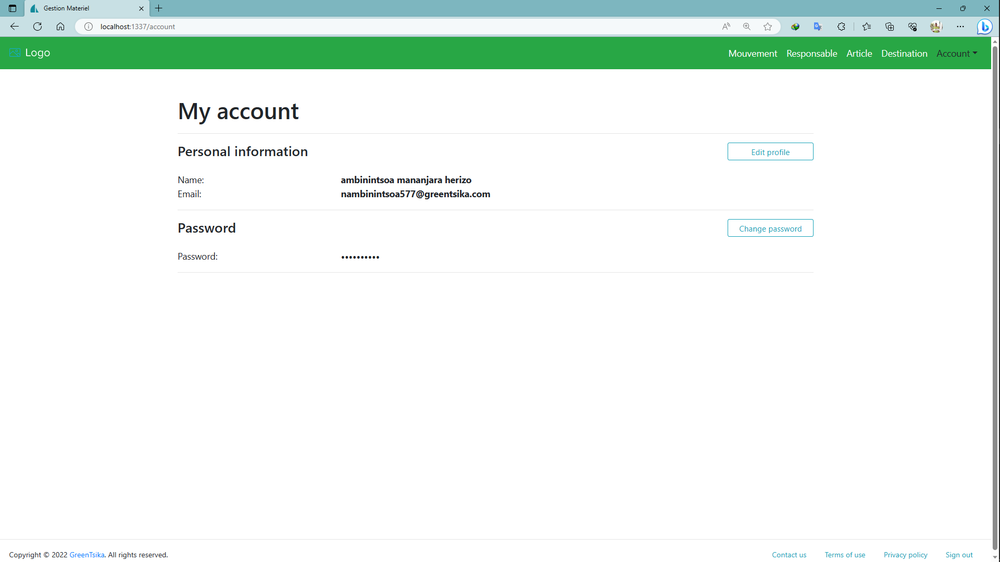
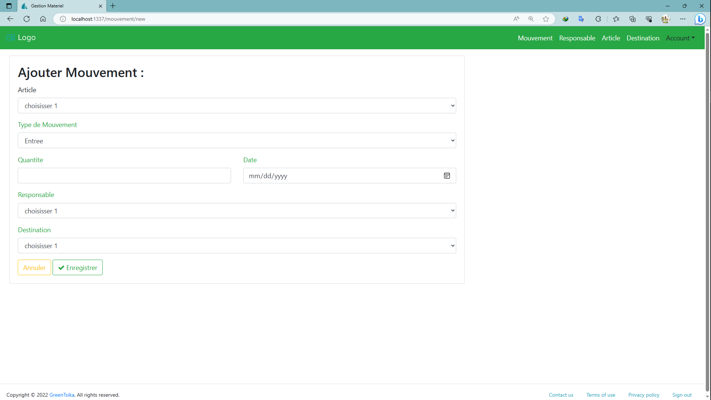
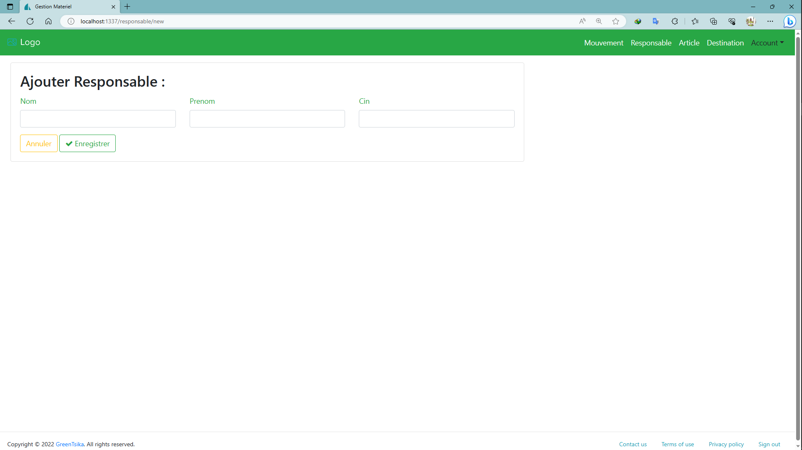
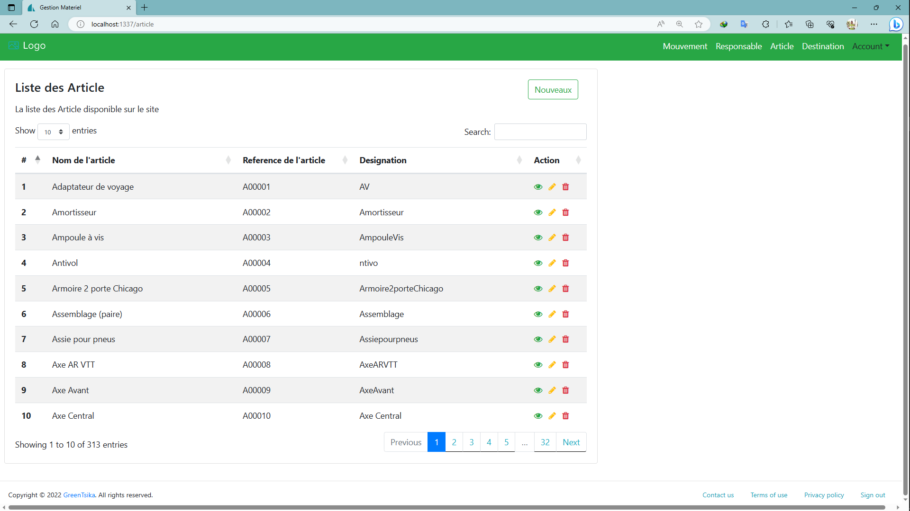
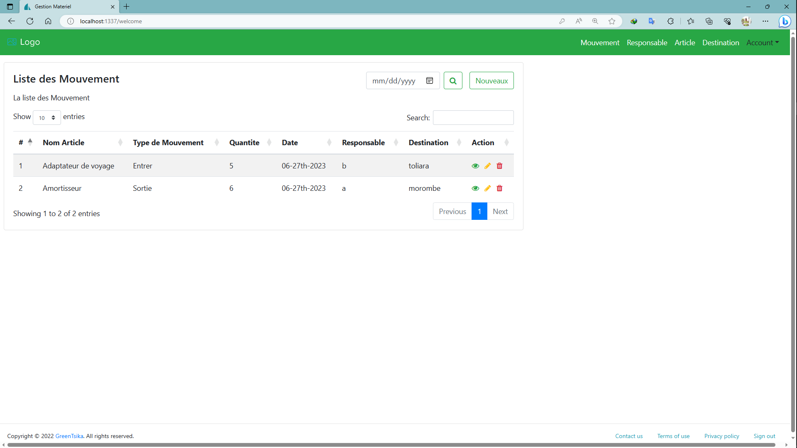

# Equipment Management App

This is a web application built with Sails.js that allows you to manage the equipment of an organization.

- `Authentification`

- `Form`
  

- `Listing`
  

  

## Requirements

Before running the application, make sure you have the following requirements installed:

- [Node.js](https://nodejs.org) (v14 or higher)
- [MongoDB](https://www.mongodb.com) (v4 or higher)

## Routes

The following routes are available in the application:

- `GET /`: Displays the homepage or redirects to the appropriate page.
- `GET /mouvement`: Displays the list of movements.
- `GET /mouvement/new`: Shows the form for creating a new movement.
- `POST /mouvement/create`: Creates a new movement.
- `POST /mouvement/search`: Searches for movements.
- `POST /mouvement/update`: Updates a movement.
- `GET /mouvement/show/:id`: Shows the details of a specific movement.
- `GET /mouvement/edit/:id`: Shows the edit form for a specific movement.
- `GET /mouvement/delete/:id`: Deletes a specific movement.
- `GET /responsable`: Displays the list of responsables.
- `GET /responsable/new`: Shows the form for creating a new responsable.
- `POST /responsable/create`: Creates a new responsable.
- `POST /responsable/update`: Updates a responsable.
- `GET /responsable/show/:id`: Shows the details of a specific responsable.
- `GET /responsable/edit/:id`: Shows the edit form for a specific responsable.
- `GET /responsable/delete/:id`: Deletes a specific responsable.
- `GET /article`: Displays the list of articles.
- `GET /article/new`: Shows the form for creating a new article.
- `POST /article/create`: Creates a new article.
- `POST /article/update`: Updates an article.
- `GET /article/show/:id`: Shows the details of a specific article.
- `GET /article/edit/:id`: Shows the edit form for a specific article.
- `GET /article/delete/:id`: Deletes a specific article.
- `GET /destination`: Displays the list of destinations.
- `GET /destination/new`: Shows the form for creating a new destination.
- `POST /destination/create`: Creates a new destination.
- `POST /destination/update`: Updates a destination.
- `GET /destination/show/:id`: Shows the details of a specific destination.
- `GET /destination/edit/:id`: Shows the edit form for a specific destination.
- `GET /destination/delete/:id`: Deletes a specific destination.

## Dependencies

The application relies on the following dependencies:

- `@sailshq/connect-redis` (v3.2.1): Redis session store for Sails.js.
- `@sailshq/lodash` (v3.10.3): Utility library for JavaScript.
- `@sailshq/socket.io-redis` (v5.2.0): Redis adapter for Socket.IO in Sails.js.
- `moment` (v2.29.4): JavaScript library for manipulating dates and times.
- `sails` (v1.5.2): MVC framework for Node.js.
- `sails-hook-apianalytics` (v2.0.3): Sails.js hook for collecting API analytics.
- `sails-hook-organics` (v2.0.0): Sails.js hook for organizing models, controllers, services, and policies.
- `sails-hook-orm` (v4.0.0): Sails.js hook for managing the ORM (Object-Relational Mapping) layer.
- `sails-hook-sockets` (v2.0.0): Sails.js hook for enabling real-time communication using Socket.IO.
- `sails-mongo` (v2.0.0): MongoDB adapter for Sails.js.

Please make sure to install these dependencies by running `npm install` before starting the application.

## Getting Started

To get started with the Equipment Management App, follow these steps:

1. Clone the repository: `git clone https://github.com/Zo-ambinintsoa/gestion-materiel.git`
2. Install the dependencies: `npm install`
3. Start the application: `npm start`
4. Access the application in your browser at `http://localhost:1337`

That's it! You should now be able to use the Equipment Management App to manage the equipment of your organization.

## License

This project is licensed under the [MIT License](LICENSE).
